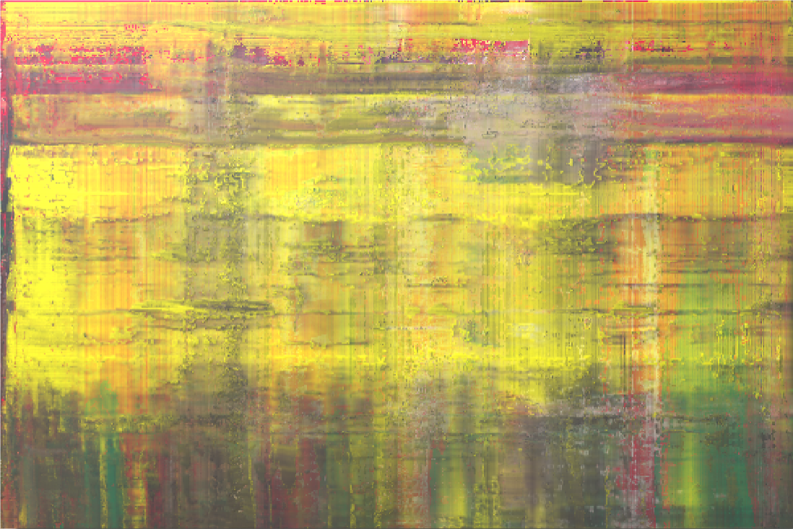
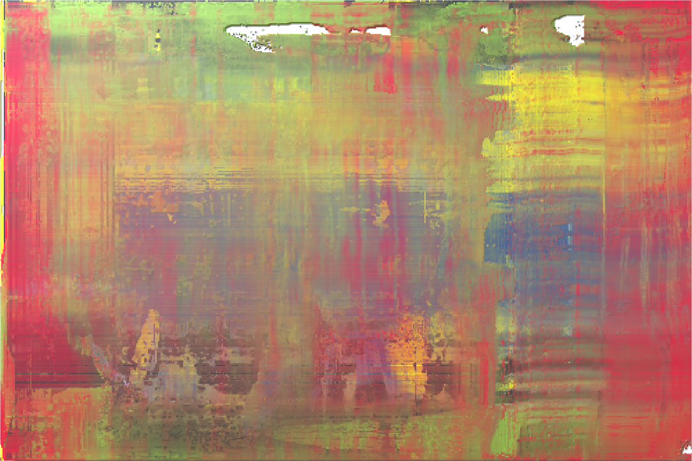
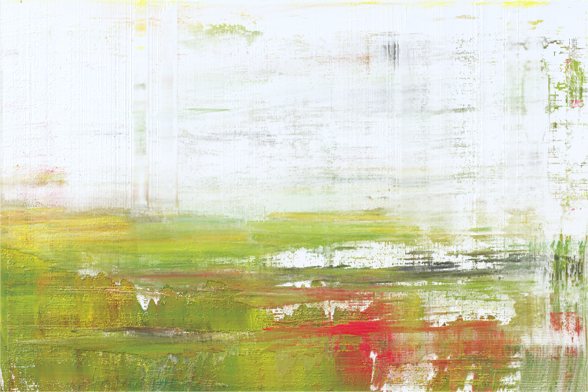
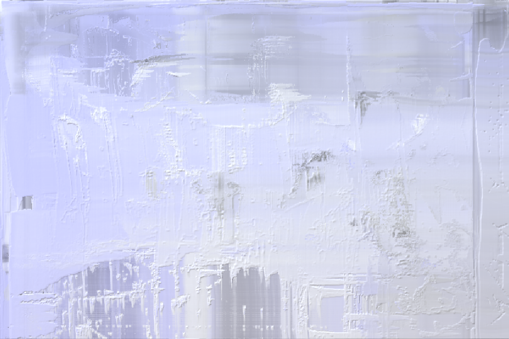
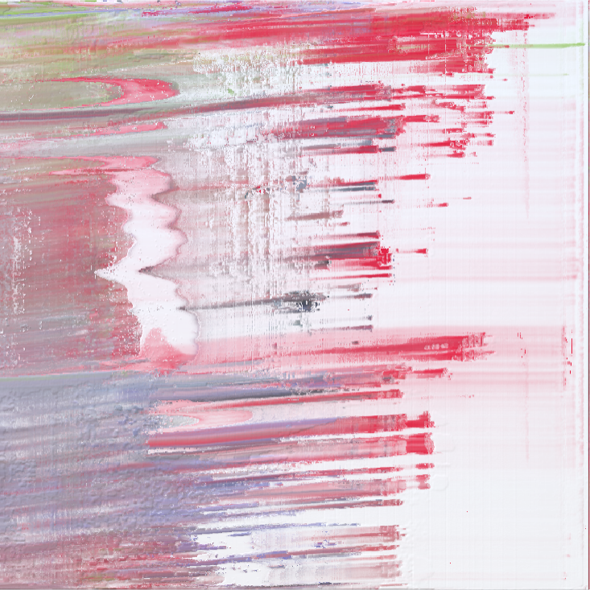
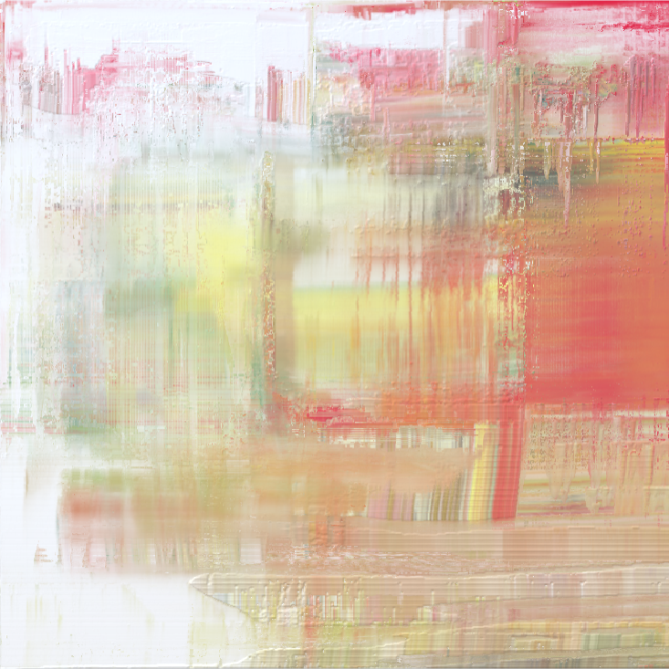
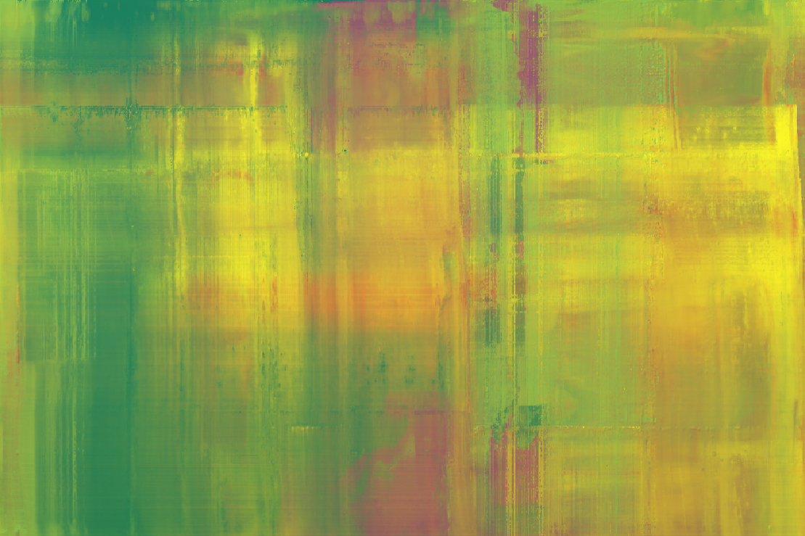
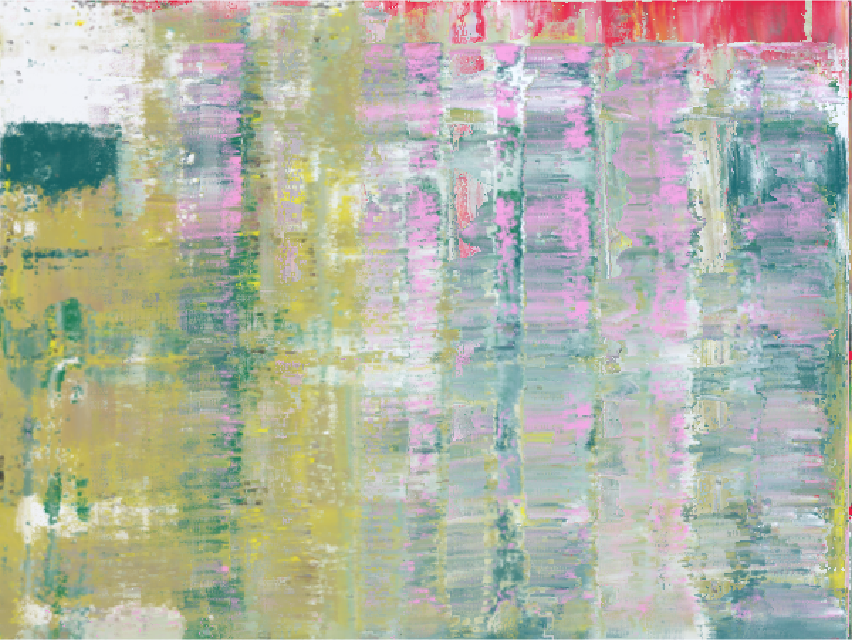

# Layers

This project was developed during my research project and master thesis at HTW Berlin and allows users to create abstract art with virtual oil paint. The simulation is based on the concept of bidirectional paint transfer but extends previous approaches for applicability to working with a special kind of squeegee. Key improvements are:
+ Support for arbitrarily many layers of paint
+ New, time-independent model for calculating the amounts of transferred paint
+ More precise imprint calculation
+ Advanced interaction model, so a user can interact with varying layers of paint within a single stroke

The simulation itself is mostly implemented in HLSL Compute Shaders to provide scalable performance.

## Results

## Demo
